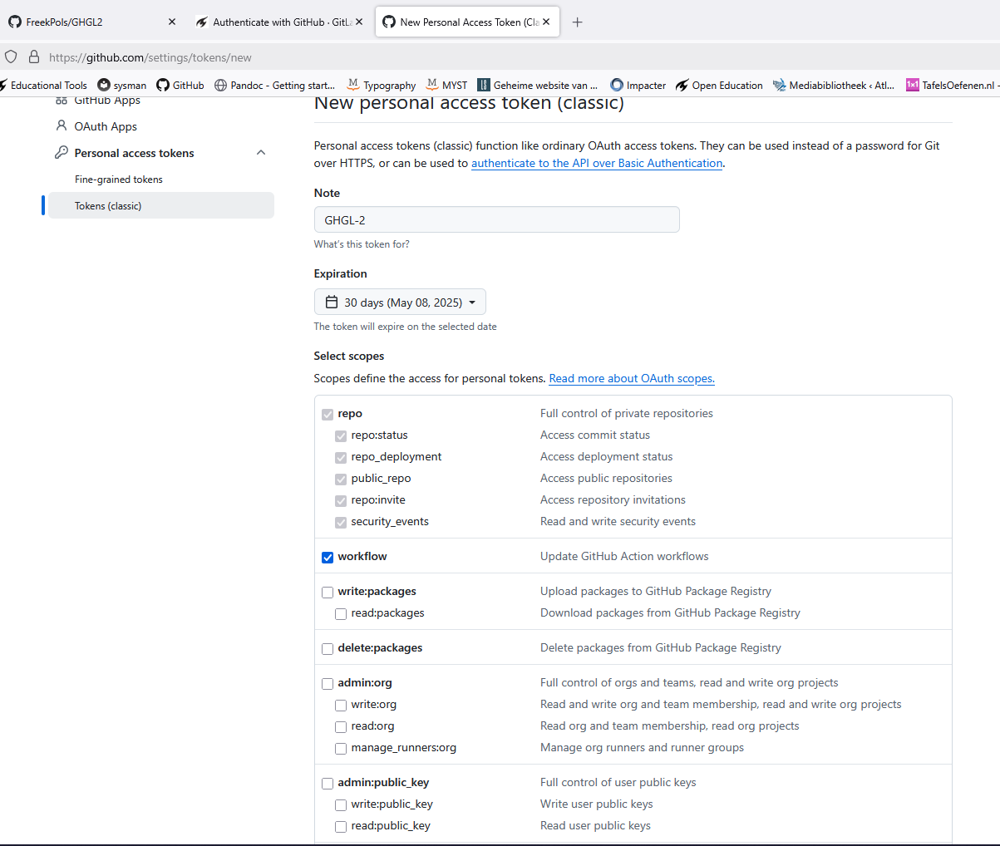

# GHGL aan elkaar knopen


* Maak nieuwe repository (public) vanuit een template of open een bestaande GH repo. (Hier is aangenomen dat er al een GH workflow bestaat)
* Ga naar GL en maak een nieuw project met dezelfde naam als de repo op GH (zodat zichtbaar is dat het om dezelfde repo gaat).
* Kies voor *Import project* en vervolgens *GitHub*.
* Je wordt nu gevraagd om een personal access token in te voeren welke aan gemaakt moet worden op GH.
* Klik op de link [https://github.com/settings/tokens](personal access token) in GL.
* Klik op *Generate new token* en kies voor classic. 
* Maak een titel, kies een expiration date en vink repo en workflow aan, zie printscreen



* Klik *Generate token* en kopieer de PAT in de GL en klik *Authenticate*.  
* Importeer nu de repo die je wilt kopiëren.
* Wanneer alle bestanden zijn gekopieerd van GH naar GL, ga naar je GL repo, klik op *settings* en dan *access tokens* om een nieuwe access token aan te maken. Kies voor *owner* en vink *api*, *read_repository* en *write_repository* aan. Kies een zo lang mogelijke *expiration date* zodat GH zo lang mogelijk schrijfrechten naar GL heeft.
* Kopieer de access token en ga naar GH / secrets and variables / actions en creeer een *New repository secret*. Geef deze een duidelijk naam, bijv. *GLPAT*.
* Open de github workflow en voeg onderstaande script toe aan de workflow (onderaan)

```
  sync:
    runs-on: ubuntu-latest
 
    steps:
      - name: Checkout GitHub Repository
        uses: actions/checkout@v4
        with:
          fetch-depth: 0  # Ensures all history is cloned
 
      - name: Push to GitLab
        run: |
          git config --global user.name "GitHub Actions"
          git config --global user.email "actions@github.com"
 
          # Add GitLab as a remote (update URL for your repo)
          git remote add gitlab https://oauth2:${{ secrets.GLPAT }}@gitlab.tudelft.nl//fpols/GHGL2.git
          # Use force-with-lease for safety
          git push gitlab
```

* Let op, vervang de GL repo link en de naam van de repository secret (hier GLPAT).
* De connectie tussen GH en GL is nu gemaakt. Elke commit naar GH wordt nu ook gecommit naar GL.